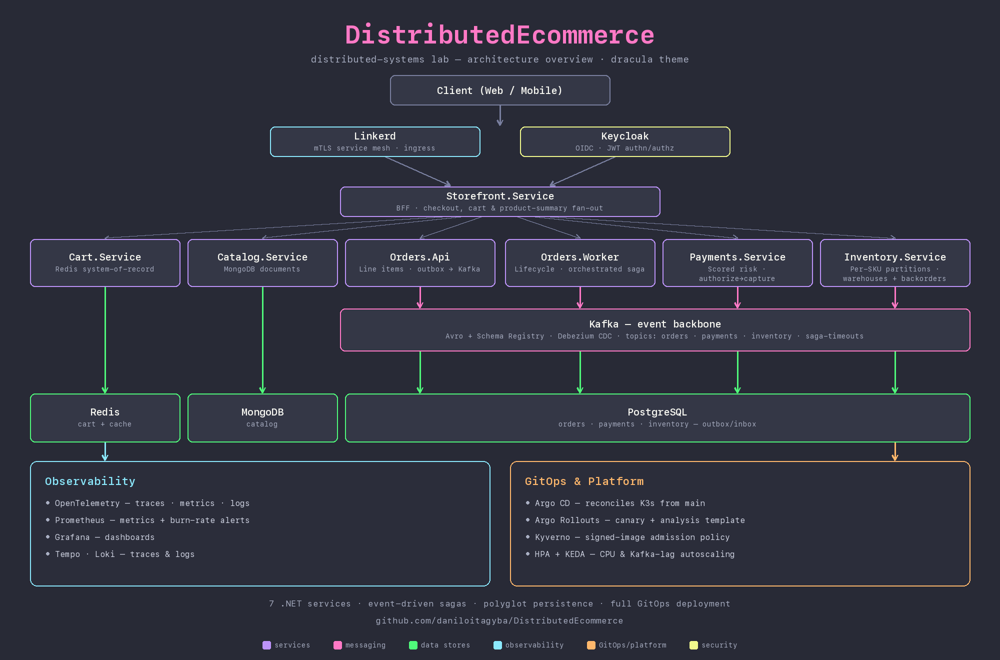

# DistributedEcommerce

[](https://github.com/daniloitagyba/DistributedEcommerce/actions/workflows/ci.yml)



A practical distributed-systems lab, built incrementally milestone by milestone into a multi-service e-commerce system: polyglot persistence, event-driven sagas, and a full GitOps deployment. Every milestone's report under [`docs/`](docs/) records what actually happened validating it against a live deployment — including what broke — not just the intended design.

Seven .NET services (`Orders.Api`/`Orders.Worker`, `Payments.Service`, `Catalog.Service`, `Inventory.Service`, `Cart.Service`, `Storefront.Service`) coordinate through Kafka and HTTP, backed by PostgreSQL, MongoDB, and Redis, each chosen for what it's actually good at rather than defaulting to one store for everything.

## What it demonstrates

- **A real e-commerce domain** — orders with line items priced server-side against the live catalog (the client never states a price), promotions composed by a rules engine (NRules), cent-exact discount allocation across lines (NodaMoney), coupons with validity windows and redemption limits enforced atomically under concurrent checkout, payment decisions scored from customer history rather than a fixed amount threshold, a real authorize-then-capture money flow where the method (Card vs Pix) decides whether a hold is placed at all, an order lifecycle driven by an explicit transition table through picking, shipping and delivery, partial returns whose refunds come out of what was actually charged rather than the list price, loyalty tiers derived from lifetime spend that stack with the other promotions, stock spread across warehouses with a property-tested allocation policy that splits an order only when no single building can fill it, three payment methods whose differences the domain actually respects - a card hold, an instant Pix, and a boleto that waits unpaid - and orders that wait on a backorder queue instead of cancelling outright when the network is momentarily short, released in strict arrival order as restocks land. See the full progression from [`docs/domain/milestone-66-line-items-pricing-and-risk.md`](docs/domain/milestone-66-line-items-pricing-and-risk.md) through [`docs/domain/milestone-74-backorders.md`](docs/domain/milestone-74-backorders.md).
- **Delivery guarantees** — transactional Outbox + Inbox for idempotent, at-least-once Kafka processing; a durable event log.
- **Sagas** — both choreographed (`Payments.Service` reacting autonomously) and orchestrated (an explicit 4-step saga — reserve inventory, decide payment, commit or *compensate* by releasing the reservation) side by side, for comparison.
- **Polyglot persistence** — PostgreSQL for transactional state, MongoDB for heterogeneous catalog documents, Redis as an actual system of record for carts (not just a cache).
- **Resilience & chaos engineering** — Polly pipelines on every dependency, proven against real fault injection (Toxiproxy, Chaos Mesh network partitions and pod kills), not just configured and trusted.
- **Distributed concurrency without a database lock** — Kafka partition-key ownership serializes per-SKU stock reservations; a leader election keeps a scheduled sweeper single-flighted across replicas.
- **CQRS, event sourcing, schema evolution, CDC** — a denormalized read model, an append-only event store, Avro + Schema Registry, and Debezium change-data-capture.
- **Formal & simulation verification** — a TLA+ model proving the saga can't resurrect a completed order, cross-checked against thousands of seeded deterministic-simulation runs of the real code.
- **Property-based testing** — pricing invariants (the total is never negative, per-line discount shares sum to exactly the order discount, a coupon never costs the shopper more) checked by CsCheck against 10,000 generated orders each, with shrinking to a minimal counterexample — and confirmed to actually fail when the logic is broken.
- **Quality & security guardrails in CI** — async/threading analyzers, cyclomatic complexity and module-size limits, secrets/CVE scanning, mutation testing, and coverage gates, each calibrated against a real measurement, not a guess. N+1 query detection (an EF Core interceptor) and memory-leak heap-growth checks (a k6 soak against live Prometheus heap metrics) run at the runtime/manual level, not as CI gates — see [`docs/cicd/milestone-59-quality-security-guardrails.md`](docs/cicd/milestone-59-quality-security-guardrails.md).
- **Autoscaling** — CPU-based HPA and Kafka-lag-based KEDA scaling, load tested and measured, not asserted.
- **GitOps & progressive delivery** — Argo CD reconciling from `main`, Argo Rollouts canaries gated by a Prometheus analysis template, with an actual proven automatic rollback.
- **Service mesh, mTLS, authn/authz** — Linkerd, Keycloak-issued JWTs, Kyverno policy enforcement, and keyless-signed, SBOM'd, vulnerability-scanned container images.
- **SLOs & burn-rate alerting** — multi-window, multi-burn-rate alert rules validated against a real, deliberately broken deploy.
- **Full observability** — traces, metrics, and logs correlated end to end via OpenTelemetry, visualized in Grafana.

See [`docs/`](docs/) for the full, dated write-up of every milestone, organized by topic (`architecture`, `resilience`, `saga`, `gitops`, `security`, `slo`, and more).

## Quickstart (Docker Compose)

Requires Docker with Compose v2. Everything below runs entirely on your machine — no external server or cluster needed.

```bash
cd compose
cp .env.example .env
# edit .env: replace the placeholder passwords with your own random values

docker compose up --detach --wait                          # infrastructure: Postgres, Kafka, Redis, MongoDB, Keycloak, observability stack
docker compose --profile compose-apps up --detach --wait    # all seven application services

../scripts/keycloak-configure-realm.sh                      # one-time: creates the auth realm/client the API expects
```

Then get a token and create an order:

```bash
TOKEN=$(../scripts/keycloak-get-token.sh)

# Checkout: the server prices the line items against the live catalog and
# applies whatever promotions match - the request never states a price.
curl --request POST http://127.0.0.1:8088/orders \
  --header "Authorization: Bearer $TOKEN" \
  --header 'Content-Type: application/json' \
  --data '{
    "customerId": "customer-42",
    "items": [{"sku": "SKU-BOOK-001", "quantity": 2}, {"sku": "SKU-ELEC-001", "quantity": 1}],
    "couponCode": "SAVE10"
  }'

# The amount-only shape from Milestone 7 still works (expand/contract - see
# docs/domain/milestone-66-line-items-pricing-and-risk.md). It creates an
# order with no line items and no pricing breakdown.
curl --request POST http://127.0.0.1:8088/orders \
  --header "Authorization: Bearer $TOKEN" \
  --header 'Content-Type: application/json' \
  --data '{"customerId":"customer-42","amount":49.90,"currency":"BRL"}'
```

The checkout response carries the breakdown - subtotal, each promotion that
fired, shipping, tax, and every line's prorated share of the discount:

```jsonc
{
  "amount": 3816.73,
  "pricing": {
    "subtotal": 4479.70,
    "discountTotal": 662.97,   // SAVE10 (10%) + 5% off electronics, stacked
    "shippingTotal": 0,        // free above 200.00
    "lines": [ /* per-line unitPrice, lineDiscount, lineTotal */ ]
  }
}
```

Seeded coupons: `SAVE10` (unlimited), `SAVE20` (min. 200,00, 5 per customer) and
`HALFOFF` (50% off, min. 100,00, capped at 100 total and **1 per customer**).
Coupons have validity windows and redemption limits, and a rejected one says
why — see [`docs/domain/milestone-67-coupon-lifecycle.md`](docs/domain/milestone-67-coupon-lifecycle.md).

- Kafka UI: `http://127.0.0.1:8080`
- Grafana: `http://127.0.0.1:3000`
- Prometheus: `http://127.0.0.1:9090`

Bring everything down with `docker compose --profile compose-apps down`.

A few pieces of infrastructure are opt-in, gated behind their own Compose profile since they
don't participate in the flow above and would otherwise idle for no reason:

| Profile | Brings up | Used by |
|---|---|---|
| `postgres-ha` | MinIO (backup target) | `kubernetes/data-platform/postgres-ha-*.yaml`, `scripts/postgres-ha-provision.sh` |
| `cdc` | Debezium + its Kafka topics | `scripts/debezium-register-connector.sh` ([Milestone 21](docs/messaging/milestone-21-debezium-cdc.md)) |
| `profiling` | Grafana Pyroscope | K3s only — `PYROSCOPE_PROFILING_ENABLED` in `kubernetes/base/*.yaml` ([continuous profiling](docs/architecture/continuous-profiling.md)) |
| `kafka-quorum-demo` | 3-broker Kafka quorum | `scripts/kafka-quorum-durability-test.sh` |
| `mongo-replicaset-demo` | 3-node MongoDB replica set | `scripts/mongo-replica-set-test.sh` |

e.g. `docker compose --profile cdc up --detach --wait`.

## Run the tests

```bash
cd apps
dotnet restore DistributedEcommerce.slnx
dotnet build DistributedEcommerce.slnx --no-restore
dotnet test DistributedEcommerce.slnx --no-build
```

Integration tests spin up real, disposable Postgres/MongoDB/Redis/Kafka containers via Testcontainers — no shared state, no manual setup.

## Repository layout

- `apps/src` — the seven services and `BuildingBlocks` (shared contracts, OpenTelemetry wiring, resilience pipelines).
- `apps/tests` — unit tests and Testcontainers-backed integration tests.
- `compose/` — the full local infrastructure and application stack.
- `kubernetes/` — production-style manifests: base resources, an Argo CD-managed overlay, cluster policies (Kyverno, network policies).
- `load-tests/k6` — versioned k6 workload profiles and thresholds.
- `observability/` — Collector, Prometheus rules, Alertmanager, Tempo, Loki, and provisioned Grafana dashboards.
- `scripts/` — repeatable build, deploy, and verification workflows.
- `docs/` — one dated report per milestone, organized by topic.

## Beyond Compose: Kubernetes + GitOps

`kubernetes/` contains the manifests this project's own deployment runs from — a K3s cluster with Argo CD reconciling `kubernetes/overlays/local` from `main`. To point Argo CD at your own fork, see [`kubernetes/argocd/application.yaml`](kubernetes/argocd/application.yaml) and [`docs/gitops`](docs/gitops/) for the reasoning and gotchas behind the setup (sealed secrets, service mesh, progressive delivery). This path assumes a real cluster and is optional — the Compose quickstart above is the fastest way to see the whole system running.
