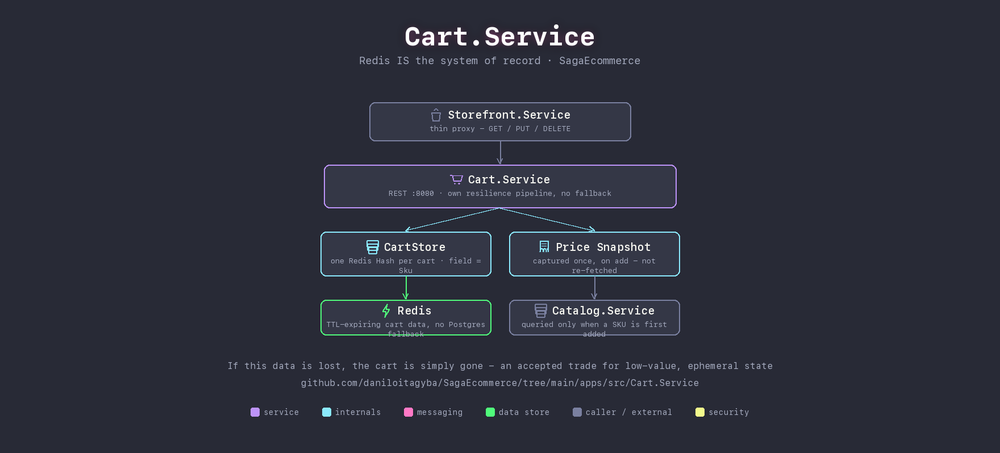

# Cart.Service

Redis **is** the system of record here, not a cache in front of one — there's no Postgres fallback and no cache-aside factory delegate. If this data is lost, the cart is simply gone; an acceptable trade for ephemeral, reconstructable, low-value state, unlike orders or payments. A cart is a single Redis Hash (field = SKU, value = JSON `CartLineItem`), so the whole cart is read and its TTL refreshed in one round trip.

## The price you saw is the price you keep — until checkout

`UnitPrice`/`ProductName`/`Currency` are snapshotted from `Catalog.Service` the moment a SKU is first added, not re-fetched on every quantity change: the cart reflects what the shopper saw when they added the item. Checkout (`Storefront.Service` → `Orders.Api`) is where prices get revalidated against the live catalog, not here.

Deliberately does **not** use the shared `redis` resilience pipeline: that pipeline's 150ms timeout is tuned for cache-aside use, where a timeout just means "fall back to Postgres." Here there's no fallback, so the same aggressive timeout would fail otherwise-successful requests under ordinary latency jitter — `CartResiliencePipeline` keeps the circuit breaker but uses a timeout suited to being the *only* path to the data.

## Talks to

| Direction | What | Why |
|---|---|---|
| in | `Storefront.Service` | thin proxy — GET / PUT / DELETE |
| out | Redis | the cart itself, TTL-expiring |
| out | `Catalog.Service` | queried once, when a SKU is first added |

## Run it

Part of the Compose stack — see the [repo root README](../../../README.md#quickstart-docker-compose). No host port: reached only through `Storefront.Service`'s proxy.

## See also

- [Milestone 42 — Cart on Redis as the primary store](../../../docs/architecture/milestone-42-cart-redis-primary-store.md)
