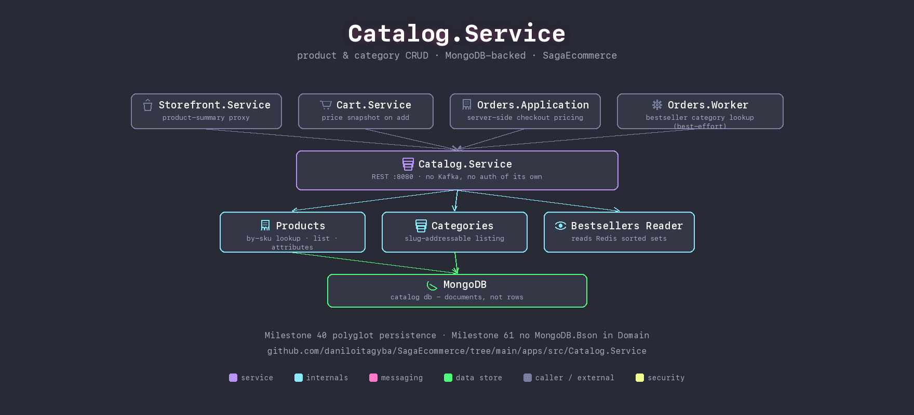

# Catalog.Service

Product and category CRUD, MongoDB-backed — the one service in this lab whose own data doesn't fit rows and columns well. Product attributes are genuinely heterogeneous per category (a t-shirt has size/color, a laptop has RAM/CPU), which in a relational schema means EAV, a JSONB column, or one table per category; a document whose shape simply varies by category is the better fit.

## Responsibilities

- **Products** — by-SKU lookup, listing, free-form attributes.
- **Categories** — a small collection of their own (not a free-text field on `Product`), so the storefront can list categories without a distinct-scan over the product collection.
- **Bestsellers reader** — reads the Redis sorted sets `Orders.Worker` writes to, joining rank with product detail.

No Kafka, no auth of its own, no Domain-layer framework dependency — `Product`/`Category` carry no `MongoDB.Bson` attributes; the ObjectId mapping lives in `Catalog.Service.Data` instead, kept out of the domain types themselves.

## Talks to

| Direction | What | Why |
|---|---|---|
| in | `Storefront.Service`, `Cart.Service`, `Orders.Application`, `Orders.Worker` | product lookups — pricing, cart snapshots, checkout, best-effort bestseller category tagging |
| out | MongoDB (`catalog` db) | the only datastore this service owns |

## Run it

Part of the Compose stack — see the [repo root README](../../../README.md#quickstart-docker-compose). No host port: reached only by other services over the Compose network.

## See also

- [Milestone 40 — Catalog on MongoDB](../../../docs/architecture/milestone-40-catalog-mongodb.md)
- [Milestone 61 — service/domain boundaries](../../../docs/architecture/milestone-61-service-domain-boundaries.md)
- [Milestone 44 — bestsellers via Redis sorted sets](../../../docs/architecture/milestone-44-bestsellers-redis-sorted-sets.md)
