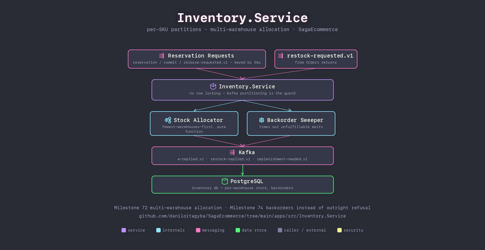

# Inventory.Service

Reserves, commits, releases, and restocks stock across a multi-warehouse network — with no row locking. Every reservation command for a given SKU is produced keyed by SKU, so Kafka's per-partition ownership guarantees exactly one replica ever handles that SKU at a time; that partitioning is the only thing preventing an oversell race, deliberately, instead of a database lock doing the same job twice.

## Fewest warehouses first

`StockAllocator` is a pure function: prefer a single warehouse that covers the whole order, and only split across several — more parcels, more shipping cost, more chances for one leg to go missing — when none can. Ties break on configured priority, then warehouse code, so two replicas reasoning about the same stock always reach the same plan.

When the network genuinely can't cover an order, it doesn't just fail: the reservation is parked as a `Backordered` wait rather than an outright refusal, and released the moment a restock covers it (oldest backorder first) — or timed out if nothing arrives in time.

## Responsibilities

- **Reserve / commit / release** — the three-step lifecycle a saga step draws on, replayed precisely from what was recorded at reservation time so commit/release never has to guess which warehouse the stock came from.
- **Backorders** — waits instead of refusing when nothing's on the shelf right now.
- **Replenishment signal** — emits on the *crossing* into a warehouse's reorder point, not on every reservation that finds it already low.

## Talks to

| Direction | What | Why |
|---|---|---|
| in | `inventory.reservation/commit/release-requested.v1`, `restock-requested.v1` | saga steps and order returns |
| out | `inventory.*-replied.v1`, `restock-replied.v1`, `replenishment-needed.v1` | saga replies and the (currently unconsumed) replenishment signal |
| out | PostgreSQL (`inventory` db) | per-warehouse stock, backorders, reservation allocations |

## Run it

Part of the Compose stack — see the [repo root README](../../../README.md#quickstart-docker-compose). No host port: reached only through Kafka.

## See also

- [Milestone 72 — multi-warehouse allocation](../../../docs/domain/milestone-72-multi-warehouse-allocation.md)
- [Milestone 74 — backorders](../../../docs/domain/milestone-74-backorders.md)
- [Milestone 73 — closing the plan gaps](../../../docs/domain/milestone-73-closing-the-plan-gaps.md)
