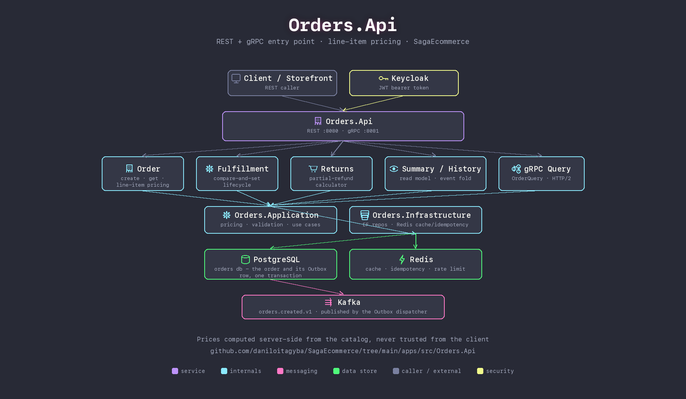

# Orders.Api

The REST + gRPC entry point for placing, tracking, and managing orders. Prices every line item server-side against the live catalog — the client states what it wants, never what it costs — and hands the rest of the order's life (saga, settlement, projections) off to [`Orders.Worker`](../Orders.Worker/README.md) via the transactional Outbox.

## Responsibilities

- **Checkout** — `POST /orders` accepts either the real line-item shape (SKU + quantity, priced server-side with promotions, coupons, and loyalty tiers via `Orders.Application`/`Orders.Domain`) or the legacy Milestone 7 amount-only shape, kept working for k6/Pact/README backward compatibility.
- **Fulfilment** — `POST /orders/{id}/fulfillment` advances the order lifecycle (`Created → Confirmed → Picking → Shipped → Delivered`) through a single compare-and-set that also queues the implied settlement command (capture on `Shipped`, void on `Cancelled`).
- **Returns** — partial or full returns, refunding each line's actually-charged total (post-discount), never list price.
- **Reads** — order summaries (CQRS read model) and full history (event-sourced fold), plus a gRPC `OrderQuery` service demonstrating HTTP/2's per-request load balancing under Linkerd.

## Talks to

| Direction | What | Why |
|---|---|---|
| in | `Client` / `Storefront.Service` | REST, JWT-authenticated via Keycloak |
| out | PostgreSQL (`orders` db) | order + line items + Outbox row, one transaction |
| out | Redis | response cache, idempotency keys (fenced writes), distributed rate limiting |
| out | Kafka `orders.created.v1` | published by the Outbox dispatcher, never inline with the request |

## Run it

Part of the Compose stack — see the [repo root README](../../../README.md#quickstart-docker-compose). Two replicas (`orders-api-1`, `orders-api-2`) sit behind the `nginx` gateway on `127.0.0.1:8088`; internally it's REST on `:8080` and gRPC on `:8081`.

## See also

- [Milestone 66 — line items, pricing, and risk](../../../docs/domain/milestone-66-line-items-pricing-and-risk.md)
- [Milestone 69 — order lifecycle](../../../docs/domain/milestone-69-order-lifecycle.md)
- [Milestone 70 — returns and refunds](../../../docs/domain/milestone-70-returns-and-refunds.md)
- [Milestone 48 — Redis fencing tokens](../../../docs/resilience/milestone-48-fencing-tokens.md)
