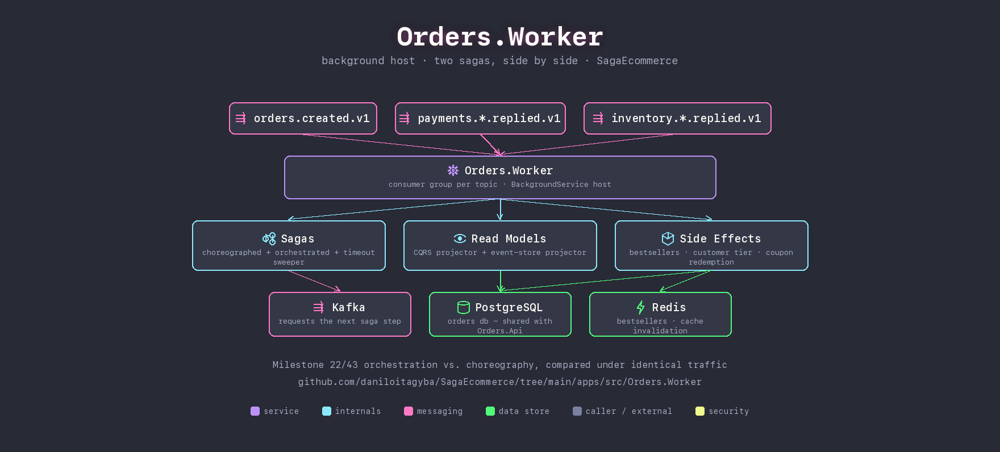

# Orders.Worker

A background host running the order's entire life after `Orders.Api` accepts it: two independent sagas (choreographed and orchestrated), a CQRS read-model projector, an event-sourced append-only log, and a handful of side-effect stores (bestsellers, loyalty tiers, coupon redemption) — each its own Kafka consumer group, all under one process.

## The two sagas, side by side

`Saga:Mode` (`Choreography` / `Orchestration` / `Both`) decides which paths this instance runs. Both reach the same reliability bar — inbox dedup, a persisted state row, outbox-published replies — on purpose: the whole point is a fair comparison, not "hardened vs. not."

- **Choreographed** — `OrderMessageProcessor`/reply consumers react autonomously to events; no service is told what to do next.
- **Orchestrated** — `OrderSagaOrchestrator` explicitly requests each step and owns the timeout (`SagaTimeoutSweeper`, gated on `LeaderElectionService` so only one replica sweeps).

Reserve inventory → decide payment → commit or *compensate* (release inventory), with a fourth path for a network that can't cover the order right now: park it in `Backordered` and wait for a restock instead of cancelling outright.

## Responsibilities

- **Sagas** — drives the order from `Created` through settlement, keyed by SKU-partitioned Kafka topics so a reservation request is never processed concurrently with another for the same SKU.
- **Read models** — `OrderProjectionProcessor` maintains a denormalized `order_summaries` table for fast reads; `OrderEventStoreAppender`/`OrderEventStoreProjector` maintain an append-only `order_events` log for temporal queries and the full audit trail.
- **Side effects** — records completed orders against loyalty tiers, settles or releases coupon redemptions, and increments Redis sorted sets for bestseller tracking (best-effort — a Catalog outage degrades this, never the saga).

## Talks to

| Direction | What | Why |
|---|---|---|
| in | `orders.created.v1`, `payments.*.replied.v1`, `inventory.*.replied.v1` | drives every saga step and projection |
| out | `inventory.*-requested.v1`, `payments.decision/capture/void-requested.v1` | the next saga step |
| out | PostgreSQL (`orders` db, shared with `Orders.Api`) | saga state, projections, event log |
| out | Redis | bestsellers, cache invalidation after a status change |

## Run it

Part of the Compose stack — see the [repo root README](../../../README.md#quickstart-docker-compose). No host port: it's a pure background worker, reached only through Kafka and the shared `orders` database.

## See also

- [Milestone 22 — orchestration vs. choreography](../../../docs/saga/milestone-22-orchestration-vs-choreography.md)
- [Milestone 43 — saga compensation](../../../docs/saga/milestone-43-saga-compensation.md)
- [Milestone 56 — TLA+ saga verification](../../../docs/saga/milestone-56-tla-plus-saga-verification.md)
- [Milestone 58 — deterministic simulation](../../../docs/architecture/milestone-58-deterministic-simulation.md)
- [Milestone 36 — leader election](../../../docs/architecture/milestone-36-leader-election.md)
- [Milestone 44 — bestsellers via Redis sorted sets](../../../docs/architecture/milestone-44-bestsellers-redis-sorted-sets.md)
- [Milestone 74 — backorders](../../../docs/domain/milestone-74-backorders.md)
