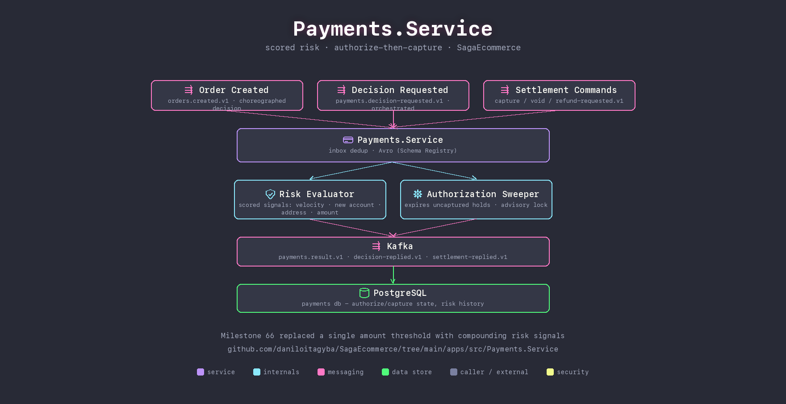

# Payments.Service

Decides whether to approve a payment, then moves the money — split into two explicit phases (authorize, then capture) rather than one boolean, so a card's hold at checkout and the actual charge at shipment are different, representable states.

## Scored risk, not a threshold

`PaymentRiskEvaluator` replaced "decline anything over 1000" with signals that compound: `HIGH_VALUE`, `FIRST_PURCHASE`, `VELOCITY` (rapid repeat orders), `NEW_ACCOUNT` (a minutes-old account ordering again), `ADDRESS_MISMATCH`, `ATYPICAL_AMOUNT` (relative to *this* customer's own history). None of them alone triggers a decline; a large first purchase from a brand-new account does, because the signals stack. Both saga paths (choreographed and orchestrated) run the exact same evaluator, so `Saga:Mode` comparisons are meaningful.

## Responsibilities

- **Decide** — approve or decline, scored, recorded with the reasons that fired.
- **Authorize → capture** — a card lands in `Authorized` with an expiring hold; Pix settles instantly (`Captured`); a boleto waits in `AwaitingPayment` with nothing held at all. `PaymentAuthorizationSweeper` expires holds nobody ever captured (Postgres advisory lock, not a Kubernetes Lease — `SKIP LOCKED` already makes concurrent sweeps safe).
- **Settle** — capture, void, or partial/cumulative refund, each guarded in the domain so a redelivered command is a no-op, never a double charge.

## Talks to

| Direction | What | Why |
|---|---|---|
| in | `orders.created.v1` | choreographed: decides autonomously on seeing the order |
| in | `payments.decision-requested.v1` | orchestrated: decides on explicit request |
| in | `payments.capture/void/refund-requested.v1` | settlement commands from `Orders.Api`/`Orders.Worker` |
| out | `payments.result.v1`, `decision-replied.v1`, `settlement-replied.v1` | replies back to the saga |
| out | PostgreSQL (`payments` db) | authorize/capture state and the risk-scoring history it reads |

## Run it

Part of the Compose stack — see the [repo root README](../../../README.md#quickstart-docker-compose). No host port: reached only through Kafka.

## See also

- [Milestone 66 — line items, pricing, and risk](../../../docs/domain/milestone-66-line-items-pricing-and-risk.md)
- [Milestone 68 — authorize/capture](../../../docs/domain/milestone-68-authorize-capture.md)
- [Milestone 73 — closing the plan gaps (boleto)](../../../docs/domain/milestone-73-closing-the-plan-gaps.md)
- [Milestone 22 — orchestration vs. choreography](../../../docs/saga/milestone-22-orchestration-vs-choreography.md)
