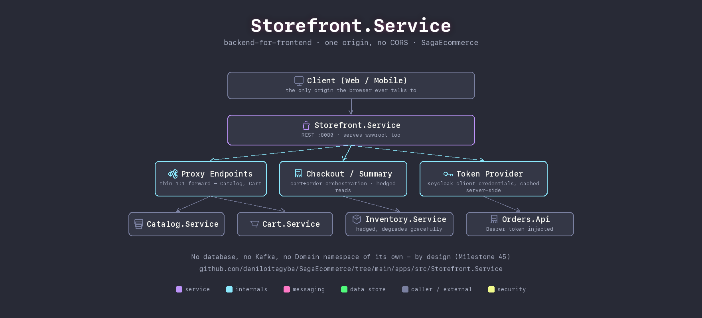

# Storefront.Service

The backend-for-frontend: the browser talks to exactly one origin, avoiding CORS entirely and keeping every other service's internal cluster address out of client-side code. It also serves the static frontend (`wwwroot`) — so from the browser's point of view, this *is* the site.

## Two kinds of route

- **Proxy Endpoints** — thin, generic 1:1 forwards to `Catalog.Service` and `Cart.Service`. No logic beyond relaying the request and response verbatim.
- **Checkout / Product Summary** — the genuine BFF logic. `GetProductSummaryAsync` fans `Catalog.Service` and `Inventory.Service` out in parallel and degrades gracefully if Inventory is slow or down (optionally hedged: a second request fires if the first hasn't answered within a configurable delay, since the mesh load-balances new connections per request and has a real chance of landing on a different pod). `CheckoutAsync` turns a cart into an order and only clears the cart *after* `Orders.Api` accepts it — clearing first and having the order call fail would strand the shopper with an empty cart and nothing purchased.

`KeycloakTokenProvider` holds a server-side `client_credentials` token (cached, refreshed before expiry) so the browser never needs to know `Orders.Api` requires auth, and its client secret never reaches client-side code.

No database, no Kafka, no Domain namespace of its own — by design.

## Talks to

| Direction | What | Why |
|---|---|---|
| in | `Client (Web / Mobile)` | the only origin it ever talks to |
| out | `Catalog.Service`, `Cart.Service` | proxied 1:1 |
| out | `Inventory.Service` | hedged reads for product summaries |
| out | `Orders.Api` | checkout, with a service-to-service Bearer token injected |

## Run it

Part of the Compose stack — see the [repo root README](../../../README.md#quickstart-docker-compose). The one public entry point: `127.0.0.1:8089`.

## See also

- [Milestone 45 — Storefront as a BFF](../../../docs/architecture/milestone-45-storefront-bff.md)
- [Milestone 54 — backpressure and tail latency (hedged reads)](../../../docs/performance/milestone-54-backpressure-tail-latency.md)
